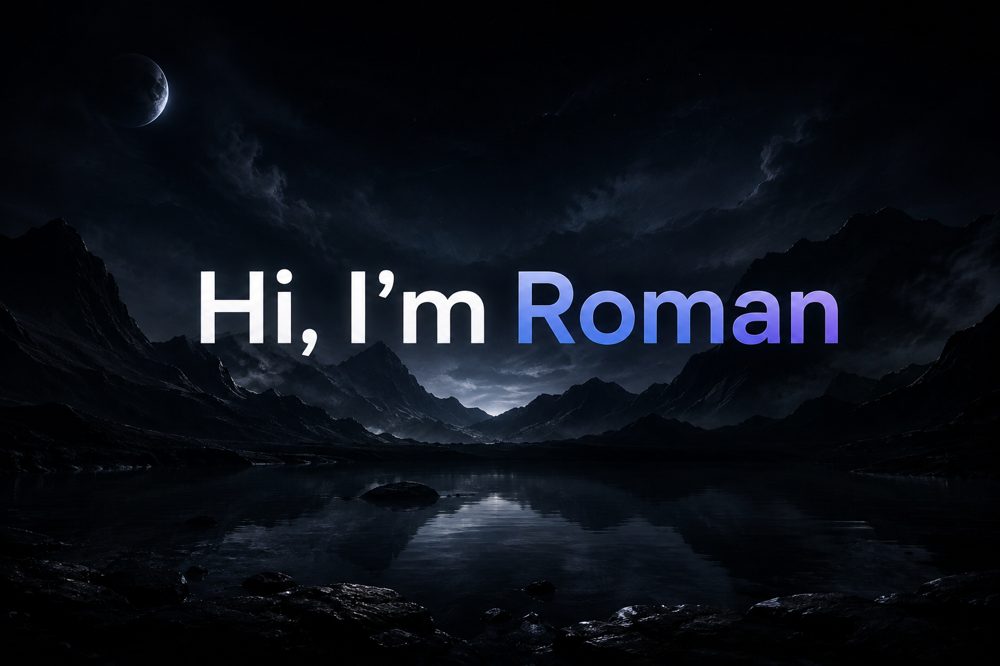

# 👋 Hi, I'm Roman

## 💻 About Me:

**🌱 Currently learning programming**

**🚀 Building my own projects**

**🎯 Always learning and improving**

## 🛠️ Skills

- `HTML`

- `CSS`

- `JavaScript`

- `Python`

📊 GitHub

**Code is not just text — it's a way to create something new.**

